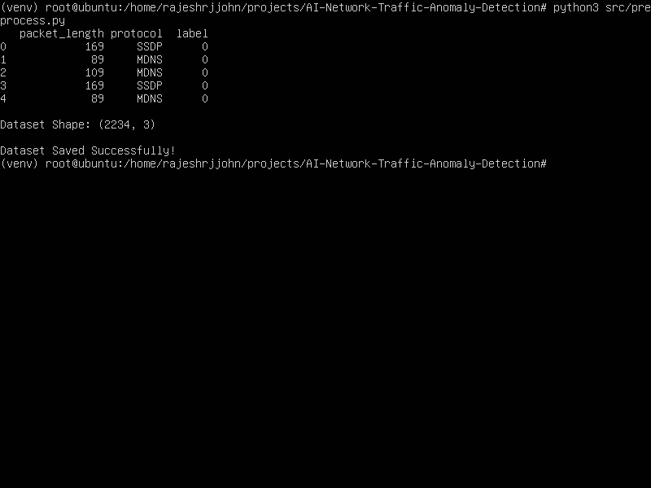
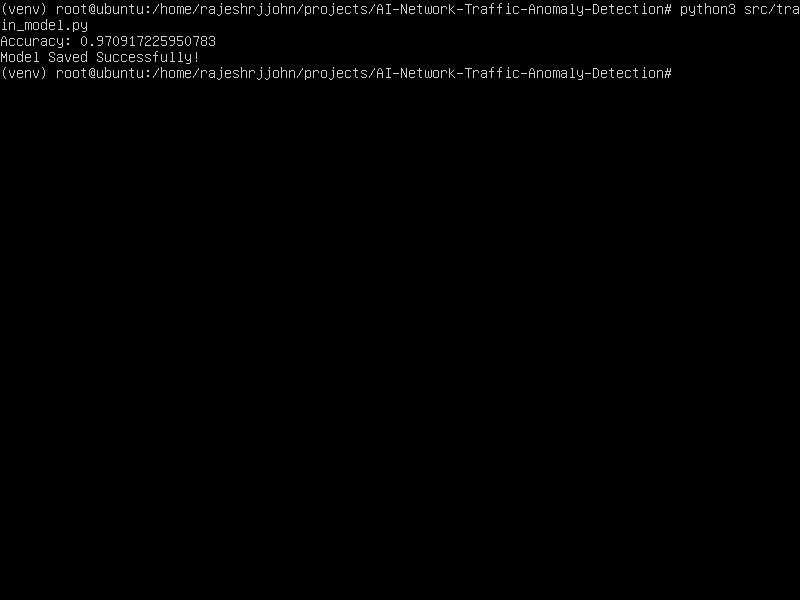
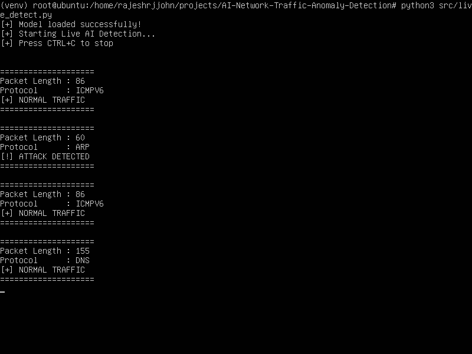
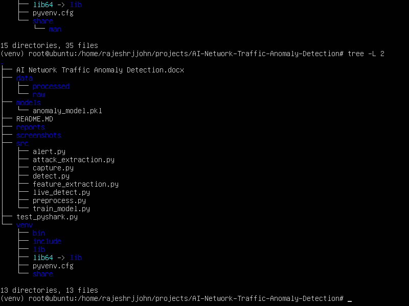

# AI-Based Network Traffic Anomaly Detection

## Project Status

✅ Version 1.0 Complete

This project implements machine learning-based network traffic anomaly detection with real-time packet monitoring, alert logging, and reporting features.

### Current Features

- Network traffic preprocessing
- Random Forest ML model
- 97.09% detection accuracy
- Real-time packet capture using Scapy
- Live anomaly detection
- Alert logging
- CSV reporting
- Ubuntu Linux support

### Future Enhancements

- Advanced web dashboard
- Additional traffic features
- Multiple ML algorithms
- Email alert notifications

## Overview

AI Network Traffic Anomaly Detection is a Machine Learning-based cybersecurity project that identifies suspicious network traffic by analyzing packet features. The system classifies traffic as either **Normal** or **Attack** using a trained Random Forest model.

## Features

* Network traffic feature extraction
* Data preprocessing and labeling
* Machine Learning model training
* Real-time anomaly detection
* Attack and normal traffic classification
* Command-line detection interface
* Ubuntu/Linux compatible

## Technologies Used

* Python 3
* Pandas
* Scikit-learn
* Joblib
* Ubuntu Linux
* Virtual Environment (venv)

## Project Structure

AI-Network-Traffic-Anomaly-Detection/

├── data/

│ └── processed/

│ ├── traffic_features.csv

│ ├── attack_features.csv

│ └── final_dataset.csv

├── models/

│ └── anomaly_model.pkl

├── src/

│ ├── preprocess.py

│ ├── train_model.py

│ ├── detect.py

│ ├── capture.py

│ ├── feature_extraction.py

│ └── attack_extraction.py

├── screenshots/

├── reports/

└── README.md

## Installation

### Clone Repository

```bash
git clone https://github.com/yourusername/AI-Network-Traffic-Anomaly-Detection.git
cd AI-Network-Traffic-Anomaly-Detection
```

### Create Virtual Environment

```bash
python3 -m venv venv
source venv/bin/activate
```

### Install Dependencies

```bash
pip install pandas scikit-learn joblib
```

## Usage

### Step 1: Preprocess Dataset

```bash
python3 src/preprocess.py
```

### Step 2: Train Model

```bash
python3 src/train_model.py
```

Example Output:

```text
Accuracy: 0.9709
Model Saved Successfully!
```

### Step 3: Run Detection System

```bash
python3 src/detect.py
```

Example:

```text
Enter Packet Length: 500
Enter Protocol: SSDP
[!] ATTACK DETECTED
```

## Machine Learning Model

Algorithm Used:

* Random Forest Classifier

Input Features:

* packet_length
* protocol

Output Classes:

* 0 = Normal Traffic
* 1 = Attack Traffic

## Results

* Model Accuracy: 97.09%
* Successfully detects anomalous network traffic
* Lightweight and easy to deploy

## Future Enhancements

* Real-time packet capture using Scapy
* Flask-based Web Dashboard
* Integration with Wireshark
* IDS alert generation
* Email notifications for detected attacks
* Deep Learning-based anomaly detection

## Screenshots

1. Dataset preprocessing

2. Model training

3. Detection results

4. Project folder structure


## Author

## Author

**RAJESH K**

Cybersecurity Professional specializing in Network Security, Threat Detection, Vulnerability Assessment, and Security Automation. Passionate about developing AI-driven security solutions and enhancing organizational cyber resilience through proactive defense strategies.

**Technical Skills:** Python, Linux, Networking, Burp Suite, Nmap, Nessus, Wireshark, Machine Learning

GitHub: https://github.com/rajeshrjjohn

Location: Coimbatore, Tamil Nadu, India
